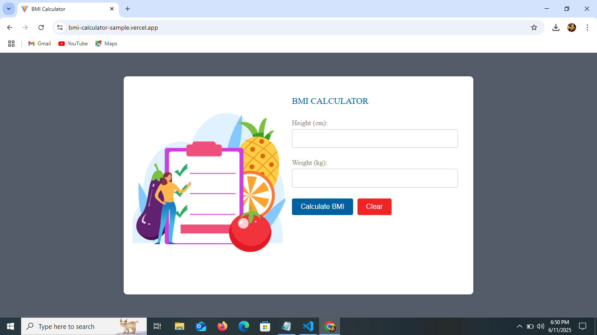
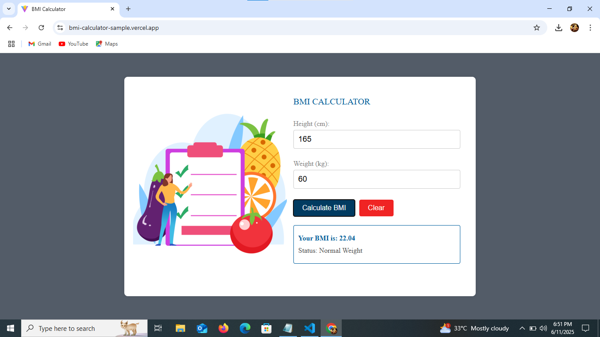
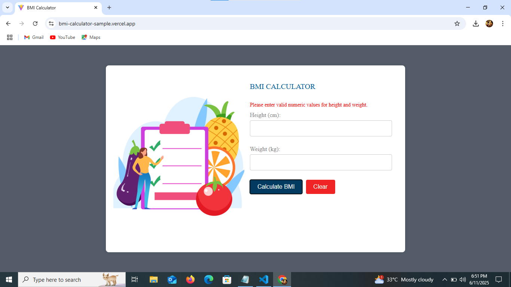

# BMI Calculator 

A responsive and user-friendly **BMI (Body Mass Index) Calculator** built with **React.js**. This app allows users to enter their height and weight, calculates their BMI, and displays a health status based on the result.

## Demo

🔗 [Live Demo](https://bmi-calculator-sample.vercel.app/)  

## Developed By
**Gayathri G**  
GitHub: [GAYATHRI1006](https://github.com/GAYATHRI1006)

## Screenshot

  
  
  

## Features

- Calculates BMI from user input (height in cm and weight in kg)
- Categorizes BMI into health ranges:
  - Underweight
  - Normal weight
  - Overweight
  - Obese
- Real-time error handling and validation
- Clear/reset functionality
- Built with modern React practices using Hooks

## How to Use

1. Enter your **height** in centimeters.
2. Enter your **weight** in kilograms.
3. Click on the **Calculate BMI** button.
4. Your BMI and corresponding health status will be displayed.
5. Use the **Clear** button to reset all inputs and results.

## Logic Used

- Height is converted from centimeters to meters.
- BMI is calculated with the formula:

BMI = weight / (height in meters)^2

- Classification:
- BMI < 18.5 → Underweight
- 18.5 ≤ BMI < 24.9 → Normal weight
- 25 ≤ BMI < 29.9 → Overweight
- BMI ≥ 30 → Obese

- Input validation is done using RegExp: `/^\d+$/` for numeric inputs.

## Technologies Used

- **React.js** (Functional Components + Hooks)
- **CSS** (Custom styles in `App.css`)
- **JavaScript** for validation and calculation logic
